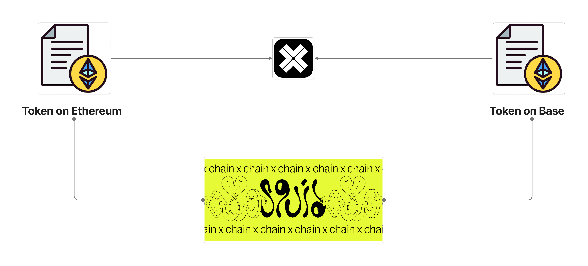

# Integrating Cross-Chain Functionality with **Axelar** and **Squid Router**

In the rapidly evolving world of blockchain, the ability to transfer assets and data across different chains seamlessly is becoming increasingly crucial. **Axelar Network**, with its robust cross-chain communication infrastructure, combined with the **Squid Router**, offers a powerful solution for developers looking to integrate cross-chain functionality into their applications. This blog post will guide you through the process of setting up a cross-chain integration using Axelar, focusing on Ethereum Sepolia and Base Sepolia networks.

## What is **Axelar**?

**Axelar** is a decentralized network that facilitates secure cross-chain communication. It acts as a universal overlay network, enabling dApps to communicate with each other across different blockchain platforms. With Axelar, developers can leverage the power of cross-chain transfers, ensuring that their applications are not limited to a single blockchain ecosystem.

## What is **Squid Router**?

**Squid Router**, also known as 0xSquid, is a protocol built on top of the Axelar Network. It enables cross-chain liquidity routing and swaps, allowing users to perform one-click cross-chain transactions. By utilizing Axelar's General Message Passing (GMP) capabilities, Squid Router simplifies the process of adding cross-chain functionality to applications.

## Setting Up Cross-Chain Integration

### Architecture Overview


*Figure 1: Architecture of Cross-Chain Integration using Axelar and Squid Router.*

### Prerequisites

Before you begin, ensure you have the following:
* **Node.js and npm** installed on your machine.
* A basic understanding of **blockchain and smart contracts**.
* Access to **Ethereum Sepolia and Base Sepolia test networks**.
* An account with some **testnet ETH** for transaction fees.

### Step 1: Clone the Repository

Start by cloning the repository containing the integration scripts:
```bash
git clone <repository-url>
cd Axelar-Testing
```

### Step 2: Install Dependencies

Navigate to the project directory and install the necessary dependencies:
```bash
npm install
```

### Step 3: Configure Environment Variables

Create a `.env` file in the root directory and add the following environment variables:
```plaintext
PRIVATE_KEY=<your_private_key>
ETHEREUM_SEPOLIA_RPC_URL=<your_ethereum_sepolia_rpc_url>
BASE_SEPOLIA_RPC_URL=<your_base_sepolia_rpc_url>
ETHEREUM_MOON_TOKEN_ADDRESS=<your_ethereum_token_address>
BASE_MOON_TOKEN_ADDRESS=<your_base_token_address>
```

### Step 4: Deploy Smart Contracts

Deploy the necessary smart contracts on both Ethereum Sepolia and Base Sepolia networks. Ensure you update the `.env` file with the deployed contract addresses.

### Step 5: Run the Integration Script

Execute the integration script to register token metadata, link tokens, and transfer tokens across chains:
```bash
npx hardhat run scripts/axelar-crosschain-integration.ts
```

### Step 6: Verify Token Transfers


*Figure 2: Axelar Explorer showing successful cross-chain token transfer.*

Uncomment the token transfer lines in the script and provide a valid receiver address to test token transfers between the two networks. You can verify the transfers using Axelar Explorer as shown above.

## Listing Your Token on Squid Router

Once you've set up your cross-chain integration using Axelar's Interchain Token Service (ITS), you can list your token on Squid Router to enable seamless cross-chain swaps for users. This expands the utility of your token by making it accessible across multiple blockchain ecosystems through a user-friendly interface.

### Steps to List Your Token on Squid Router

1. **Ensure your token is properly set up with Axelar ITS**
   - Verify that your token is registered on the Interchain Token Service
   - Confirm that token linking is working correctly between your target chains

2. **Prepare token information**
   - Token name, symbol, and decimals
   - Token contract addresses on all chains where it's deployed
   - Token manager addresses from the Interchain Token Service
   - Token ID generated during the registration process

3. **Submit a listing request to Squid**
   - Fork the Squid configuration repository
   - Add your token details to the configuration files
   - Create a pull request with comprehensive information about your token

4. **Testing and verification**
   - Ensure cross-chain transfers work properly between all listed chains
   - Verify liquidity is available for trading on respective chains

5. **Final approval**
   - The Squid team will review your submission
   - Once approved, your token will be available for cross-chain swaps on Squid Router

For detailed instructions and technical requirements, visit the [official Squid Router token listing documentation](https://docs.squidrouter.com/adding-tokens/interchain-token-its-listings/how-to-list).

## Conclusion

By following these steps, you can successfully set up a cross-chain integration using **Axelar** and **Squid Router**. This setup not only enhances the functionality of your dApp but also broadens its reach across multiple blockchain ecosystems. As the blockchain space continues to grow, tools like Axelar and Squid Router will play a pivotal role in ensuring seamless interoperability between different networks.

For more information, visit [Axelar's official documentation](https://docs.axelar.dev/) and explore the possibilities of cross-chain development.
